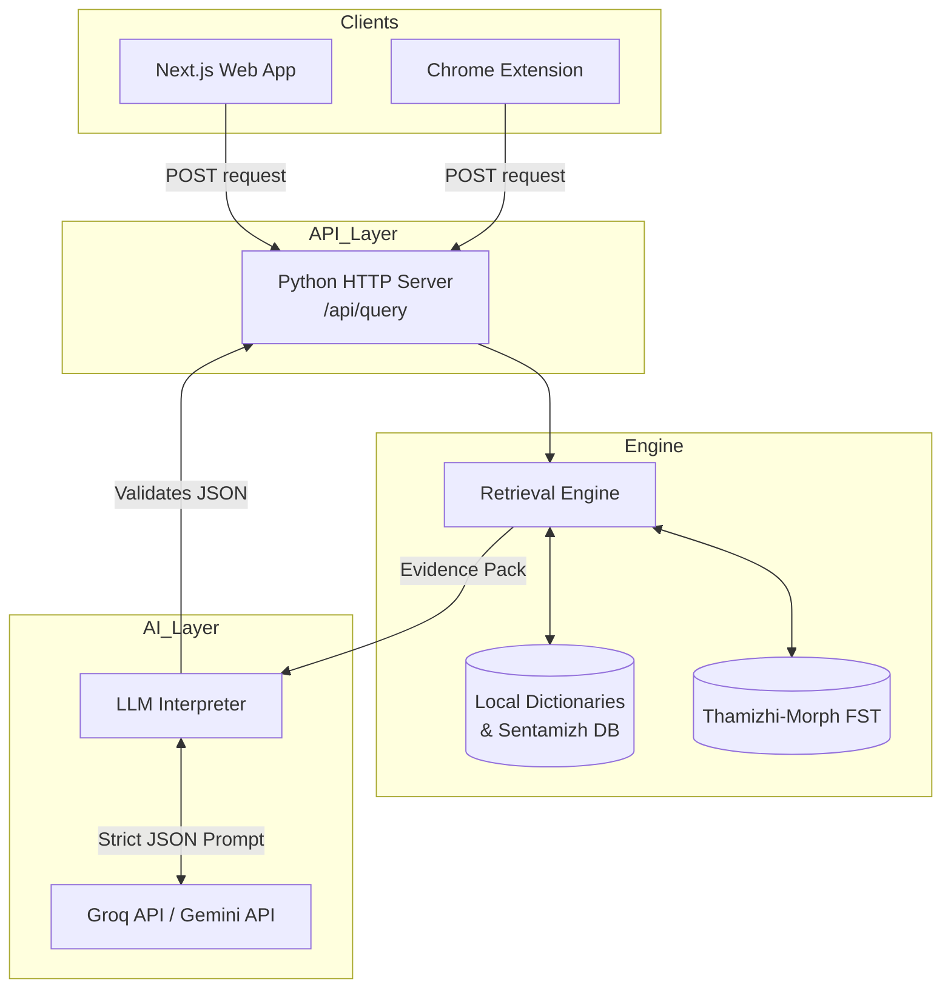

# SOL AI: Tech Stack & System Architecture

SOL AI is a sophisticated **Tamil Etymological and Morphological Intelligence system** built with a modular, decoupling approach. It consists of three primary components: a Python-based retrieval/inference backend, a Next.js web application, and a Chrome extension.

---

## 1. Tech Stack

### Backend (Retrieval & AI Interpretation)
*   **Language:** Python 3
*   **Web Server:** Custom built-in Python `http.server` (No heavy frameworks like Flask/FastAPI used, ensuring a minimal dependency footprint).
*   **Morphological Engine:** `thamizhi-morph` (FOMA/Finite State Transducer) for core word analysis.
*   **AI/LLM Providers:** 
    *   Google Gemini API (`gemini-3.6-flash`)
    *   Groq API (`qwen/qwen3.8-27b`)
    *   *Deterministic Mock Engine (used as an offline/error fallback)*
*   **Data Validation:** Pydantic (strict JSON schema validation for LLM outputs).

### Frontend (Web Application)
*   **Framework:** Next.js (React)
*   **Styling:** TailwindCSS
*   **Icons:** Lucide React
*   **Architecture:** Component-driven (`WordExplorer`, `MorphologyCard`, `LiteraryContextCard`, etc.)

### Browser Extension
*   **Platform:** Google Chrome (Manifest V3)
*   **Language:** Vanilla JavaScript (`content.js`, `popup.js`, `service-worker.js`)
*   **Styling:** Vanilla CSS (`content.css`, `popup.css`)

---

## 2. System Architecture

The system follows a **Retrieval-Augmented Generation (RAG) pattern** where deterministic morphological data is combined with AI synthesis.

### 2.1 The Flow of a Request
1.  **Input:** A user queries a Tamil word (e.g., "கல்வி") either via the Web App search bar or by highlighting text using the Extension.
2.  **Context Extraction:** If using the extension, the inline JavaScript isolates the specific sentence the word was found in and sends it as `context` alongside the query.
3.  **Retrieval (Deterministic):** The Python backend parses the query. It hits local databases and the FOMA morphological engine to find exact POS tags, literary references (e.g., Sangam literature verses), and related dictionary words. This generates an `EvidencePack`.
4.  **AI Synthesis (Non-Deterministic):** The `EvidencePack` is bundled into a highly strict prompt and sent to the LLM (Groq or Gemini). The AI's *only* job is to synthesize the definition and contextual meaning—it is explicitly forbidden from hallucinating facts.
5.  **Post-Processing & Injection:** To prevent LLM formatting errors or token-limit crashes (like HTTP 429), the Python server actively bypasses the AI for structured data. It manually injects the `related_words`, `literary_context`, and `morphology` directly from the `EvidencePack` into the final JSON payload.
6.  **Rendering:** The frontend receives the guaranteed JSON and dynamically renders the UI cards.

### 2.2 Fallback Resilience
A core architectural feature is the multi-layered fallback system:
*   If the primary LLM (e.g., Gemini) goes down or hits a 403, it falls back to the secondary LLM (Groq).
*   If both APIs fail, rate-limit, or return malformed JSON, the backend automatically fails-over to a **Deterministic Mock Interpreter**, which bypasses the AI completely and parses meanings directly from the raw dictionary databases, ensuring the application remains 100% functional offline or during API outages.
